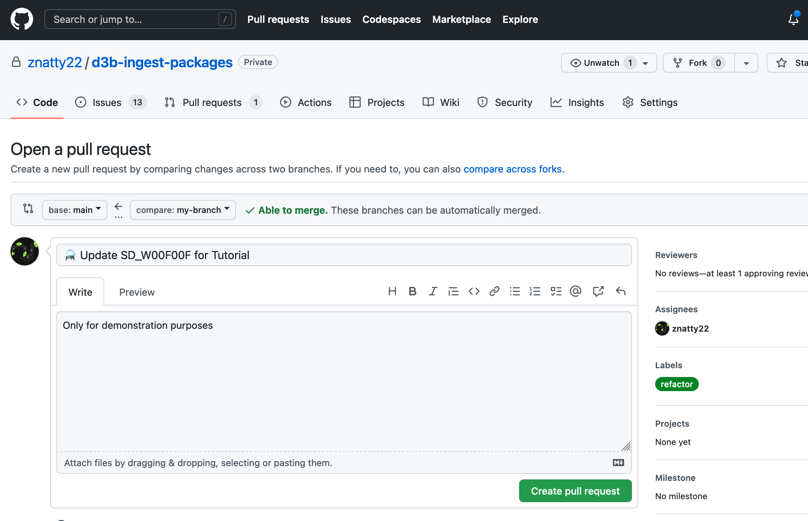
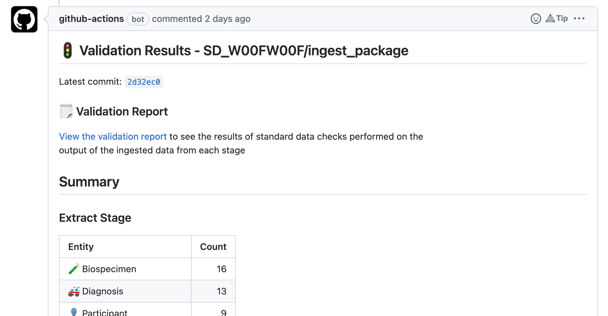
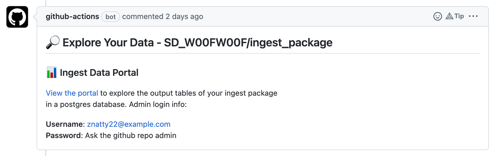
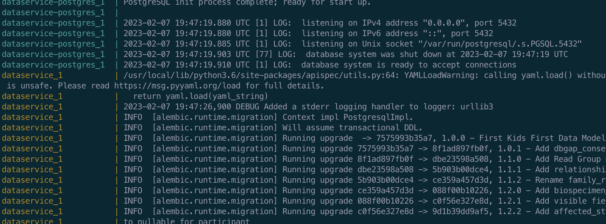
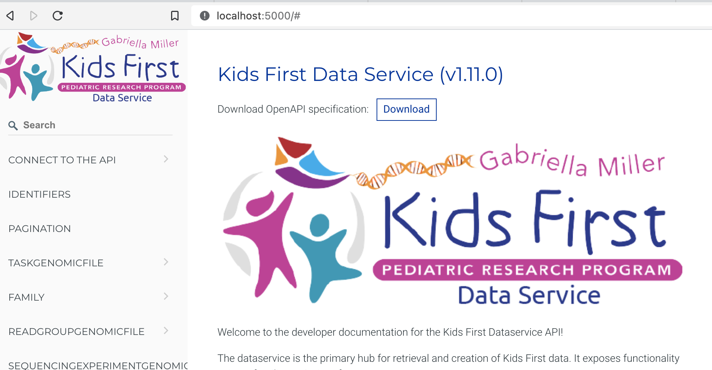
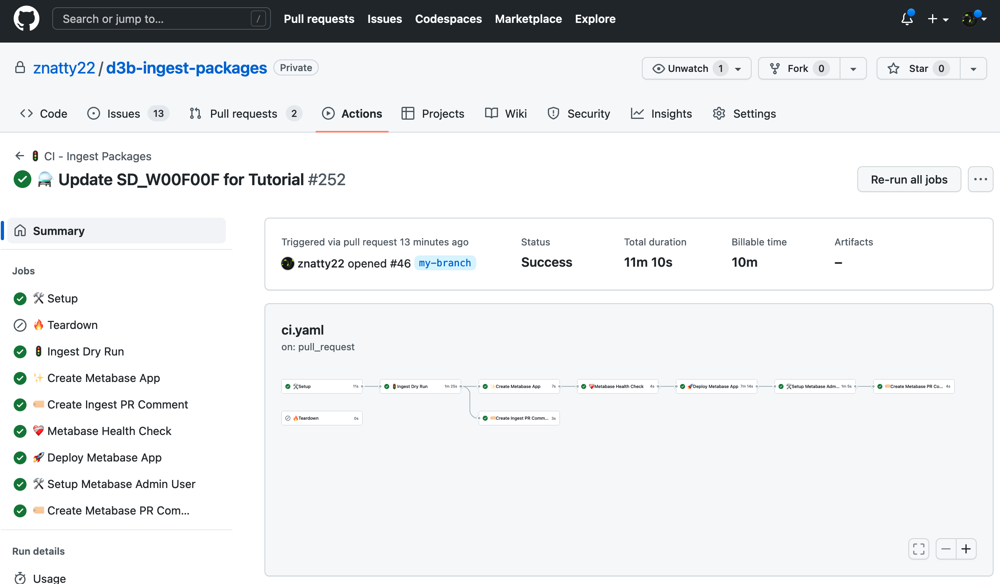

<p align="center">
  
</p>


# 👋 Welcome

## What is this repo?
Hi! Thank you for visiting this repo. The main purpose of this repo
is to version control the ingest packages (bundles of data wrangling code) 
for each unique dataset that must be cleaned and ingestd into D3b internal
or external systems.  

The repo has a Github workflow that executes each time a developer pushes 
code to their Pull Request (PR). The workflow runs the ingest package and 
then creates an "ingest data portal" where the developer and other stakeholders can explore 
the the clean data that was ingested as a result of running the ingest package.

The diagram below gives a rough idea of what happens in the worlfow:


## Benefits
This allows developers and stakeholders to have a live view of the data 
as it is being developed. This is extremely helpful in a number of ways:

- It is much easier to review ingest package code if you can see the code and 
the data it produces
- Data stakeholders can review the data as it is being developed instead of waiting 
for it to go through a long process to be released to the production environment
- Data stakeholders all have the same view of the data and can give immediate 
feedback on possible mistakes or changes that need to be made to the ingest code
- Pull Requests provide a central place to collect feedback on the code and data,
creating a historical record of data decisions.

# 📝 Background
Most of our datasets contain clinical data from research studies in the 
[NIH Kids First Program](https://kidsfirstdrc.org/)
and need to be ingested into the [Kids First Dataservice](https://github.com/kids-first/kf-api-dataservice)
or [Kids First FHIR Dataservice](https://github.com/kids-first/kf-api-fhir-service).

### Datasets
These datasets consist of many (usually 10+) messy tabular files that have to be 
cleaned up, merged, and transformed before they can be ingested into our systems.

### Ingest
Almost every dataset is a "snowflake" meaning that each has a different format
and source than the others. This means we can't just write one bit of ETL code and run it to 
ingest every dataset. The [Kids First Ingest Library](https://github.com/kids-first/kf-lib-data-ingest) 
helps us with this problem. 

The ingest library is a Python library that enables us to write 
data wrangling and ingest code in a standard way for these snowflake datasets.
The library provides a framework for authoring data wrangling code, a way 
to package the code into something called an "ingest package", and a pipeline,
to execute the ETL using the ingest package as input.  

# 💡 Pre-requisites 
As an ingest developer, you will need to have the following skills in order to 
develop ingest packages: 

- Know [Python](https://www.learnpython.org/) at an intermediate level 
- Know how to use Python [virtual environments](https://realpython.com/python-virtual-environments-a-primer/#why-do-you-need-virtual-environments)
for your Python projects
- Understand how to write an ingest package with the [Kids First Ingest Library](https://kids-first.github.io/kf-lib-data-ingest/)
- Understand [Docker](https://docs.docker.com/get-started/)/[Docker-Compose](https://docs.docker.com/compose/)
at a basic level in order to run ingest locally
- Understand how to version control code with [Git](https://www.atlassian.com/git/tutorials)
- Understand git development strategies such as [Trunk Flow](https://www.atlassian.com/continuous-delivery/continuous-integration/trunk-based-development)
and [Git Flow](https://www.atlassian.com/git/tutorials/comparing-workflows/gitflow-workflow) 
- Understand how to use [Pull Requests](https://www.atlassian.com/git/tutorials/making-a-pull-request) 
on Github for code review and request to merge changes 

**⚠️  Note** *The pre-requisites are NOT necessary to complete the quick start 
or tutorial. However, if you are going to continue ingest development they
will become ncessary.*


# 👩‍💻 Quick Start 
The quick start does not require knowledge of any pre-requisites as it gives 
step by step instructions to the reader. It is intended to give a developer a
quick glance at the end-to-end data development workflow. 

**⚠️  Note** *The quick start also skips some of the steps (e.g. local development, and 
testing) and explanation that the Tutorial covers thoroughly.*

Here is what you will do:

1. Setup our local development environment
2. Make a small change to an existing example ingest package
3. Commit our code to a local development branch 
4. Push our local code to Github and create a Pull Request (PR)
5. View the ingested data and validation report

## Setup Development Environment

```shell
# Create a local copy of the code base
$ git clone git@github.com:znatty22/d3b-ingest-packages.git
$ cd d3b-ingest-packages

# Create local branch for development
$ git checkout -b my-branch

# Create a Python virtual environment (sandbox)
$ virtualenv venv

# Activate the venv
$ source venv/bin/activate

# Install necessary Python packages
$ pip install -r requirements.txt
```

## Development 

Let's add a new extracted column to one of our extract configs in the
`SD_W00FW00F/ingest_package` ingest package: 

Open up the extract config in your favorite code editor:
```
d3b-ingest-packages/packages/SD_W00FW00F/ingest_package/extract_configs/clinical.py
```

Add a new column by adding the following extract operation to the end of the 
`operations` list: 

```python
constant_map(
    out_col="study_description",
    m="the study of canines"
)
```
## Commit and Push Code

At this point, you would normally test your change by running the ingest on 
your local machine, but we have skipped this step for brevity. The Tutorial 
covers this in detail. 

Make sure to save your work and then do the following to commit your change:

```shell
# Stage the files you want to commit
git add d3b-ingest-packages/packages/SD_W00FW00F/ingest_package/extract_configs/clinical.py

# Commit the change and write a useful commit message
git commit -m ":sparkles: Extract a study description column in clinical ext config"

# Push changes to Github
git push -u origin my-branch
```

## Prepare to Kick-Off Github Workflow

In this step you will do something to tell Github to run its workflow 
for our ingest package and not another package in this repo. 

To do this, you must update the `run.yaml` file with the path to our ingest package.
This path should be relative to the packages directory which is 
`d3b-ingest-packages/packages`.

```
# In run.yaml, change the value of package to your ingest package path

package: SD_W00FW00F/ingest_package
```  

```shell
# Commit and push the change to Github 
$ git add run.yaml
$ git commit -m ":wrench: Update run.yaml to trigger github workflow"
$ git push
```

**⚠️  Note** *You will only need to do this one time. Github will always run 
its workflow for the ingest package listed in the `run.yaml` file.*

## Open Pull Request (PR)
Now that the branch with our changes is on Github, you will need to open a Pull 
Request so that you can begin to review both the ingest code and the data that it
produces. 



Github will start its workflow for the first time once you open the PR. After 
that, it will re-run its workflow each time you push code to your PR.

## View Results 

You will be able to monitor the progress of the workflow and any logs each 
job in the workflow prints out by visiting the `Actions` tab on your PR. 

Once certain steps in the workflow complete, you'll see the two comments
appear on your PR.

### Validation Report

The first is a summary of your ingest, containing counts of various entities 
and a link to a website that contains the validation report that the ingest 
library output created. 



### Ingest Data Portal
The second PR comment contains a link to the ingest data portal. The data 
portal uses the BI/data exploration application called [Metabase](https://www.metabase.com/). 

You will be able to login to the portal as an admin. Your username will be listed 
in the PR comment and you will need to ask the repo admin for your password.




# 👩🏻‍🎓 Tutorial 

The tutorial is a more detailed version of the quick start by stepping through 
the typical development workflow for an ingest developer. 


Here is what you will do:

1. Setup our local development environment
2. Make a small change to an existing example ingest package
3. Sanity check our change by dry running our ingest 
4. Test our change by running the full ingest 
5. Commit our code to a local development branch 
6. Push our local code to Github and create a Pull Request (PR)
7. Learn about the Github workflow  
8. View the ingested data and validation report

## Setup Dev Environment

Most of the Tutorial steps require you to run shell commands in a shell session.
This tutorial assumes you're using a Mac. So first, start a shell session 
by opening up the Terminal program that comes with MacOS. 

Next, let's clone this git repo to our local machine and then 
create a branch for our work.

```shell
# Create a local copy of the code base
$ git clone git@github.com:znatty22/d3b-ingest-packages.git
$ cd d3b-ingest-packages

# Create local branch for development
$ git checkout -b my-branch
```

Next, create a Python virtual environment. [Virtual environments](https://realpython.com/python-virtual-environments-a-primer/#why-do-you-need-virtual-environments)
help us create sandboxes for our development and allow us to isolate dependencies
for each project. 

```shell
# Create the virtual env
$ virtualenv venv

# After you create, you must activate the virtual env
# so Python knows to use the packages in our virtual env called "venv"
$ source venv/bin/activate
```

Now you should have a folder called `venv` which is where you will install 
our Python packages. So last, install the dependencies for this project by 
running the following:

```shell
$ pip install -r requirements.txt
```

## Develop

In this section, you're going to make a small change to an existing ingest package
that is in the repo for demonstration and tutorial purposes.

### Make a Change
Let's add a new extracted column to one of our extract configs in the
`SD_W00FW00F/ingest_package` ingest package: 

Open up the extract config in your favorite code editor:
```
d3b-ingest-packages/packages/SD_W00FW00F/ingest_package/extract_configs/clinical.py
```

Add a new column by adding the following extract operation to the end of the 
`operations` list: 

```python
constant_map(
    out_col="study_description",
    m="the study of canines"
)
```

## Test 

We will briefly touch on ingest package testing here, but know that the local
development and test process is covered more thoroughly in the
[ingest library tutorial](https://kids-first.github.io/kf-lib-data-ingest/quickstart.html#test).

### Dry Run Ingest 

In a typical development workflow, after you make changes locally, you will want 
to test them locally by running your ingest package in dry run or test mode. 

```shell
$ kidsfirst test d3b-ingest-packages/packages/SD_W00FW00F/ingest_package
```

Dry run mode will run all 3 stages of the ingest pipeline: extract, transform, 
load - except when it runs the load stage, instead of actually loading the 
transformed data into a target service, it just prints the payloads that it 
would send. This is why its called dry-run mode. 

Dry run ingest is meant to be a quick sanity check to make sure your code 
didn't break anything in the extract/transform stages of the pipeline. 
In the next section, you will learn how to run the full ingest for a more thorough test.

### Run Full Ingest 

Often, you will also want to run the full ingest on your local machine and ensure 
that the data looks good in the service you ingested into. In this tutorial, 
you will use the Kids First Dataservice as our example.

#### Setup Local Kids First Data Service
To enable this, first you will need to run Data Service on your machine via
a [Docker-Compose](https://docs.docker.com/compose/) service stack. The 
docker-compose stack is defined in the `docker-compose.yml` file at the top 
level of this repo.

Be sure to run the command below in a different shell session than the one
you're currently in so you can view the live logs. In MacOS Terminal, you 
should be able to open a new tab to do this.

```shell
# Bring up the services in the docker-compose stack
$ docker-compose up

# For later - bring down the services in the docker-compose stack
$ docker-compose down
```
You should begin seeing the application logs from the services in 
your docker-compose stack as it sets up.



Setup takes less than 30 seconds, so soon after you bring up the service, 
you should be able to go to `http://localhost:5000` in your browser 
and see the API docs for Data Service.



Now you're ready to run your full ingest into Data Service:

```shell
$ kidsfirst ingest d3b-ingest-packages/packages/SD_W00FW00F/ingest_package
```

After your ingest completes, you should be able to visit the Data Service 
endpoints and view the data that was ingested. Again, more details on the
local development and test process can be found in the Kids First Ingest 
Library tutorial so we will stop here.

## Commit Code

Now that you've done some local testing, you're ready to commit the changes you've
made to our local branch. Make sure to save your work and then do the
following to commit your change:

```shell
# Stage the files you want to commit
git add d3b-ingest-packages/packages/SD_W00FW00F/ingest_package/extract_configs/clinical.py

# Commit the change and write a useful commit message
git commit -m ":sparkles: Extract a study description column in clinical ext config"
```
**⚠️  Note** *Please make sure to read the developer handbook [TODO]
to learn about D3b commit message standards.*


### Push to Github
Next, push your local changes to Github so that your local repo is synced with
Github's remote repo:

```shell
git push -u origin my-branch
```

## Prepare to Kick-Off Github Workflow

In this step you will do something to tell Github to run its workflow 
for our ingest package and not another package in this repo. 

To do this, you must update the `run.yaml` file with the path to our ingest package.
This path should be relative to the packages directory which is 
`d3b-ingest-packages/packages`.

```
# In run.yaml, change the value of package to your ingest package path

package: SD_W00FW00F/ingest_package
```  

```shell
# Commit and push the change to Github 
$ git add run.yaml
$ git commit -m ":wrench: Update run.yaml to trigger github workflow"
$ git push
```  

**⚠️  Note** *You will only need to do this one time. Github will always run 
its workflow for the ingest package listed in the `run.yaml` file.*

## Open a Pull Request
Now that the branch with our changes is on Github, you need to open a Pull 
Request so that you can begin to review both the ingest code and the data that it
produces. 


## Understand the Github Workflow 
Now every time you push changes to an existing Pull Request in this repo,
Github will run the following workflow:

- 🏭 **Ingest** - Run your ingest package in test/dry run mode as a sanity check to ensure
 things are working properly
- 📊 **Validation** - Publish the validation report that the ingest library produces to a public website 
specifically created for your PR
- 🗃️ **Database Load** - Load the data that was output from ingest into a database specifically created 
for your PR
- 🔎 **Ingest Portal** - Deploy an ingest data portal specifically for your PR. 
Load the data that was output from ingest into the database portal database.
You and other stakeholders may then log in to view, query, and explore the ingested data. 
As the PR owner, you will be the administrator of this portal and can invite
others to view and query the data as well

It is important to note that each PR has its own set of resources (database, 
ingest portal, etc), so that different development efforts are isolated and 
do not affect others.

You can see exactly what is happening in the Github workflow by viewing the 
workflow status in the Actions tab:



You should also be able to click on any of the jobs in the workflow to see 
detailed logs.

## View Results 

You will know when certain steps of the workflow have completed, when you see 
the following comments added to your PR by Github: 

### Validation Report
The first is a summary of your ingest, containing counts of various entities 
and a link to a website that contains the validation report that the ingest 
library output created. 


The validation report shows you the results of standard data checks
that were run on the data output from the extract and transform stage of 
the ingest pipeline. These checks can help you quickly determine a number of 
issues: 

- **Correctness**: e.g. values for Specimen.analyte are set to `Blood` rather than `DNA`
- **Consistency**: e.g. some participants use the value `F` to denote 
the gender of the participant is female, while others use the value `Female` 
- **Relational Integrity**: e.g. 1 specimen is linked to more than 1 
person 


### Ingest Data Portal
The second PR comment contains a link to the ingest data portal. The data 
portal uses the BI/data exploration application called [Metabase](https://www.metabase.com/). 

You will be able to login to the portal as an admin. Your username will be listed 
in the PR comment and you will need to ask the repo admin for your password.


The portal has a number of different benefits:

- **Centralized Data**: anyone who is reviewing your code is 
able to see both your code and the data it produces
- **Debug Issues**: if you find issues in the validation report, now you can dig
deeper and query your data with **SQL**. Those queries can also be saved.
- **Collaboration**: as an admin of the portal, you can **invite others to view your
data, and the queries/dashboards you created

As mentioned before, Github deploys an isolated set of resources 
(e.g. portal, validation site ) for each PR, so your data is completely 
separate from another PR's data. This means you don't have to be worried about
altering or messing with anyone else's work.


# Resources (Todo)

- D3b Developer Handbook
- Kids First Help Center

