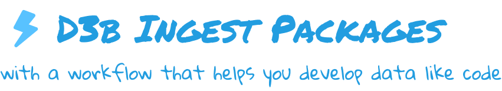
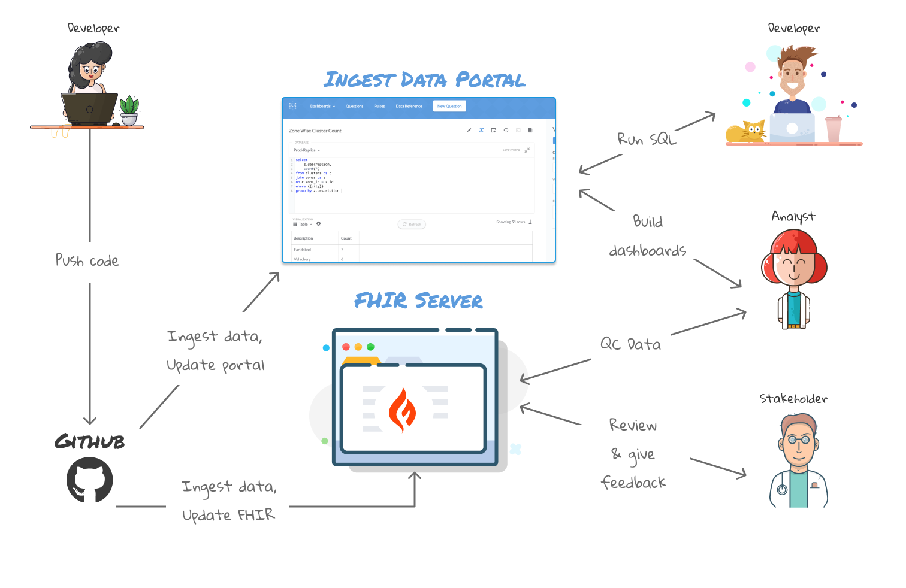

<p align="center">
  
</p>


# 👋 Welcome

## What is this repo?
Hi! Thank you for visiting this repo. The main purpose of this repo
is to version control the ingest packages (bundles of data wrangling code) 
for each unique dataset that must be cleaned and ingestd into D3b internal
or external systems.  

The repo has a Github workflow that executes each time a developer pushes 
code to their Pull Request (PR). The workflow runs the ingest package and 
then creates an "ingest data portal" where the developer and other stakeholders can explore 
the the clean data that was ingested as a result of running the ingest package.

The diagram below gives a rough idea of what happens in the worlfow:



## Benefits
This allows developers and stakeholders to have a live view of the data 
as it is being developed. This is extremely helpful in a number of ways:

- It is much easier to review ingest package code if you can see the code and 
the data it produces
- Data stakeholders can review the data as it is being developed instead of waiting 
for it to go through a long process to be released to the production environment
- Data stakeholders all have the same view of the data and can give immediate 
feedback on possible mistakes or changes that need to be made to the ingest code
- Pull Requests provide a central place to collect feedback on the code and data,
creating a historical record of data decisions.

# 📝 Background
Most of our datasets contain clinical data from research studies in the 
[NIH Kids First Program](https://kidsfirstdrc.org/)
and need to be ingested into the [Kids First Dataservice](https://github.com/kids-first/kf-api-dataservice)
or [Kids First FHIR Dataservice](https://github.com/kids-first/kf-api-fhir-service).

### Datasets
These datasets consist of many (usually 10+) messy tabular files that have to be 
cleaned up, merged, and transformed before they can be ingested into our systems.

### Ingest
Almost every dataset is a "snowflake" meaning that each has a different format
and source than the others. This means we can't just write one bit of ETL code and run it to 
ingest every dataset. The [Kids First Ingest Library](https://github.com/kids-first/kf-lib-data-ingest) 
helps us with this problem. 

The ingest library is a Python library that enables us to write 
data wrangling and ingest code in a standard way for these snowflake datasets.
The library provides a framework for authoring data wrangling code, a way 
to package the code into something called an "ingest package", and a pipeline,
to execute the ETL using the ingest package as input.  

# 💡 Pre-requisites 
As an ingest developer, you will need to have the following skills in order to 
develop ingest packages: 

- Know at an intermediate level 
- Understand how to version control code with Git 
- Understand git development strategies such as Trunk Flow and Git Flow 
- Understand how to use Pull Requests on Github for code review and request to merge changes 
- Understand how to write an ingest package with the ingest library

You can find many resources online to learn [Python](https://www.learnpython.org/), 
[Git](https://www.atlassian.com/git/tutorials), [Trunk Flow](https://www.atlassian.com/continuous-delivery/continuous-integration/trunk-based-development), 
[Git Flow](https://www.atlassian.com/git/tutorials/comparing-workflows/gitflow-workflow), 
and [Github Pull Requests](https://www.atlassian.com/git/tutorials/making-a-pull-request) 

If you are unfamiliar with the ingest library or the term "ingest package", head on
over to the [Kids First Ingest Library documentation](https://kids-first.github.io/kf-lib-data-ingest/)
to learn more before moving forward.

# 👩‍💻 Quick Start 

The quick start does not require knowledge of any pre-requisites as it gives 
step by step instructions to the reader. It is intended to give a developer
a quick glance at the end-to-end data development workflow.

In the quick start we are going to do the following: 

1. Setup our local development environment
2. Make a small change to an existing example ingest package
3. Commit our code to a local development branch 
4. Push our local code to Github and create a Pull Request (PR)
5. Learn about the Github workflow  
6. View the ingested data and validation report

## Setup Dev Environment

Before we get started we need to setup our development environment. 
Let's clone this git repo to our local machine and then create a branch for
our work.

```shell
# Create a local copy of the code base
git clone git@github.com:znatty22/d3b-ingest-packages.git
cd d3b-ingest-packages

# Create local branch for development
git checkout -b my-branch
```

Next, create a Python virtual environment. [Virtual environments](https://realpython.com/python-virtual-environments-a-primer/#why-do-you-need-virtual-environments)
help us create sandboxes for our development and allow us to isolate dependencies
for each project. 

```shell
# Create the virtual env
virtualenv venv

# Activate the virtual env
source venv/bin/activate
```

Now you should have a folder called `venv` which is where we will install 
our Python packages. So last, install the dependencies for this project by 
running the following:

```shell
pip install -r requirements.txt
```

## Development

In this section, we're going to:
- Make a small change to an existing ingest package
- Commit the change to our local branch
- Push our changes to Github so that our local development branch is synced with Github

### Make a Change
Just for the sake of demonstration we will add a new extracted column to one 
of our extract configs in the `SD_W00FW00F/ingest_package` ingest package: 

Open up the extract config:
```
d3b-ingest-packages/packages/SD_W00FW00F/ingest_package/extract_configs/clinical.py
```

Add a new column by adding the following extract operation to the end of the 
operations list: 

```python
constant_map(
    out_col="study_description",
    m="the study of canines"
)
```

**NOTE:** In a typical development workflow, after you make changes locally, you will want 
to test them locally by running your ingest package in dry run or test mode. 
This local development and test process is covered thoroughly in the [ingest library tutorial](https://kids-first.github.io/kf-lib-data-ingest/quickstart.html#test)
so we won't go over that here. 

### Commit Code 
Make sure to save your work and then do the following to commit your change to 
your local git branch. 

```shell
# Stage the files you want to commit
git add d3b-ingest-packages/packages/SD_W00FW00F/ingest_package/extract_configs/clinical.py

# Commit the change and write a useful commit message
git commit -m ":sparkles: Extract a study description column in clinical ext config"
```
**NOTE:** Please make sure to read the developer handbook [TODO]
to learn about D3b commit message standards.


### **❗️ Important:** update run.yaml

Our next step is to push the changes we've committed on our local branch, to 
Github so that the remote repository on Github is synced to our local repository.

However, before we do this, we need to do something to tell 
Github to run its workflow for our ingest package and not any of the others 
in this repo. To do this, we must update the `run.yaml` file with the path to 
our ingest package: 

```
# In run.yaml, set value of package to your ingest package path
package: SD_W00FW00F/ingest_package
```  
If there is already a path listed there, you can delete it or comment it out. 
Note that the path listed in `run.yaml` is relative to the packages directory which is 
`d3b-ingest-packages/packages`.

### Push to Github
Now we're ready to push our local changes to Github. If this is the first time
you are pushing your branch (it should be if you are going through Quick Start
for the first time) to Github you will need to do the following:

```shell
git push -u origin my-branch
```

## Open a Pull Request
Now that the branch with our changes is on Github, we need to open a Pull 
Request so that we can begin to review both the ingest code and the data that it
produces. 

When you open a Pull Request, this triggers Github to start the workflow described 
in the Welcome section.

You should be able to 

## Understand the Github Workflow 
- Open a PR
- View Github Actions log
- View PR label
- View validation report
- Query data 

# 👩🏻‍🎓 Tutorial 


# 👩‍💻 ⚡️ Advanced 

- How to run docker-compose to setup and run the full ingest pipeline locally

# Resources

- Development Handbook
- Kids First Help Center

